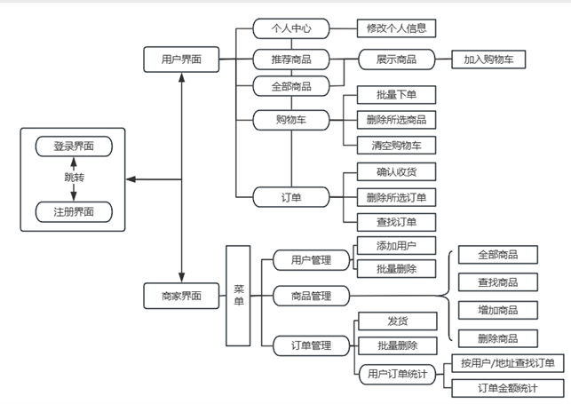

 ## 网络应用开发实验-购物网站实现
本电子商务网站为2022级《网络应用开发》的课程设计。

学号：202230441138

姓名：黄鸿展

### 开发环境：
- 开发工具：IntelliJ IDEA 2024.1.6 
- 数据库：MySQL 8.028
- 操作系统：Windows11， Alibaba Cloud Linux 3.2104 LTS 64位
- Web服务器：阿里云ECS服务器(2核2GiB)，tomcat 8.599
- 浏览器：Microsoft Edge 版本131.0.2903.70(64位)
- 编程框架：Java Servlet后端、Jsp+jQuery+css前端、tomcat作为服务器

### 网站网址：
http://8.134.196.79:8080/javaweb_mouse_war_exploded/

### 测试口令：

- 用户账号:123456 密码:111  

- 商家账号:1 密码:h1  

- 管理密码:root

### 文件架构：

- target：文件存放源代码编译之后的结果 
- src/main：存放文件源代码
  - java：存放后端java代码
   - action：存放servlet文件，负责处理网页请求并转交给service
   - dao：设计需要用到的java类（数据结构），生成SQL语句，与数据库进行交互
   - tools：设计UTIL.java，设定账户与密码连接数据库
  - webapp：存放前端代码
   - img：存放背景图、logo等图片
   - js：ajax.js/json.js/ jquery-3.4.1.min.js支持处理ajax、json、jQuery
   - css：各个网页样式的css文件，美化网页
   - WEB-INF：web.xml设置web应用配置
   - *.jsp文件：各个网页的设计
- pom.xml：配置Maven项目所用依赖项

### 网站架构：

### 简要功能说明：

#### 注册、登录功能
按下用户/商家注册按钮弹出输入框，跳转到用户界面或者商家界面。
##### 用户功能
- 个人中心

修改个人信息。
- 推荐商品

随机选出6件商品
- 全部商品

展示出所有商品，点击商品图片即可展示商品的全部信息。
- 展示商品

以卡片信息展示商品详细信息到页面中。
- 购物车

展示了所有购物车记录，可以结算和删除。
- 订单管理

展示了历史所有订单的情况，支持按地址和商品名进行查询，如果订单状态为已发货即可按“收货”功能

##### 商家功能
- 商品管理

展示了全部商品，可以按分类和名字搜索，支持增删查改
- 订单管理

点击“菜单”-“商品管理”-“商品订单”即可看到订单情况，可以删除。点击发货即可修改订单状态，提供邮件发货提醒。
- 用户订单统计

“菜单”-“用户管理”-“用户订单日志”即可看到以用户进行查询的订单情况，统计了每个用户订单共计总消费额。而点击用户的表格即可看到每个订单的具体情况。
- 用户管理

“菜单”-“用户管理”-“用户信息”，查看用户的所有信息，，可以新增用户，也可进行用户的批量删除
